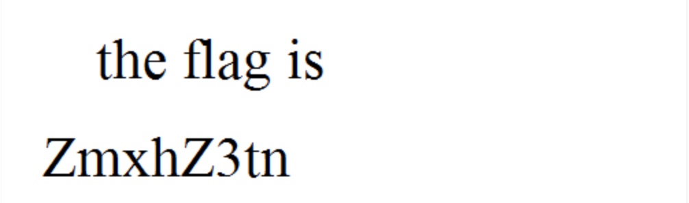

# Forensics(Hard)

## Corrupted_File

* Website: https://ctflearn.com/challenge/138

* Solution: ```Hex Fiend``` & ```Edit File```

    * We first examine the ```unopenable.gif```, and we could find that the ```git``` file start with ```39 61```

        
    
    * However, the first hex number of the ```gif``` file starts with ```47 49 46 38 39 61```. Therefore, we need to edit the file 

    * By using ```HexFiend```, we could fix the gif file

        

    * Then, there are some hints in the frames of the gif file. We could **Split the gif** to get the detailed information:

        ```the flag is ZmxhZ3tnMWZfb3JfajFmf@== DECODE IT```

        
    
    * We could then decode it and get the flag!

* Flag: ```flag{g1f_or_j1f}```

## 

* Website: 

* Solution: 

* Code: ``````

* Flag: ``````
