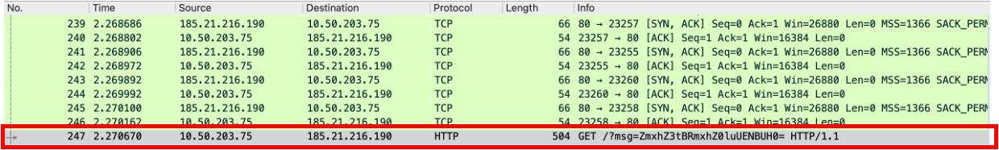
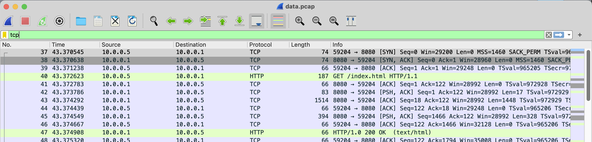
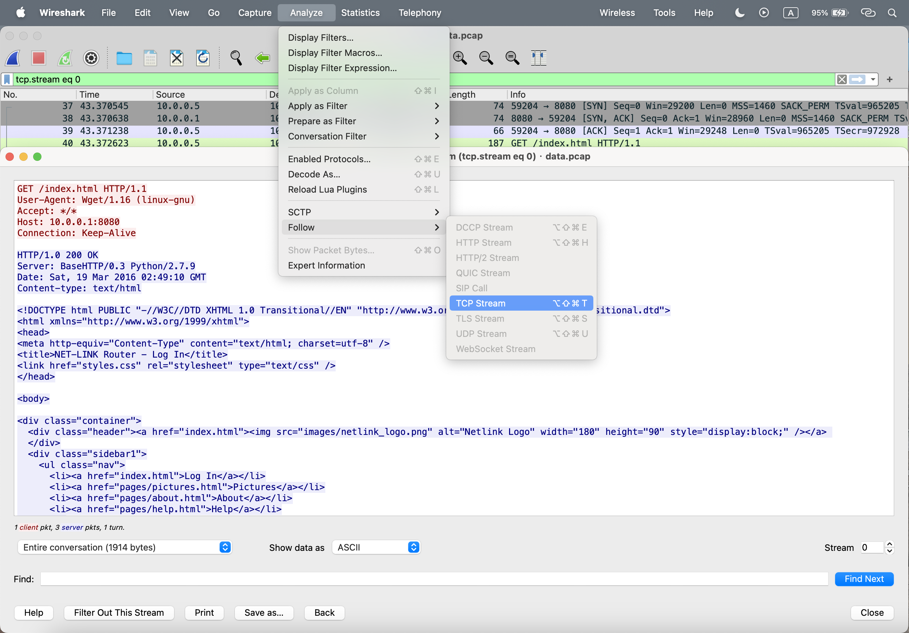
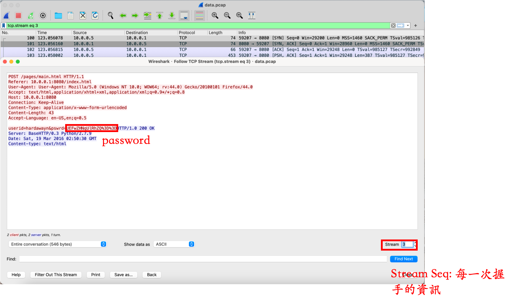

# Forensics(Medium)

## 07601

* Website: https://ctflearn.com/challenge/97

* Solution: ```binwalk``` & ```strings```

    * Use ```binwalk -e <file>``` to anlyze the file. It would thoroughly extract the files hidden in the ```<file>```

    * Then, use ```strings``` to extract information in it 

* Code: ```bash 07601/07601.sh```

* Flag: ```ABCTF{Du$t1nS_D0jo}```


## Milk_Best_Friend

* Website: https://ctflearn.com/challenge/195

* Solution: **binwalk**, **unrar** and **strings**

    * steps

        1. ```binwalk <A.img>``` 

        3. ```strings <B.img>```

* Code: ```bash Milk_Best_Friend/Milk_Best_Friend.sh```

* Flag: ```flag{eat_more_oreos}```

## A_CAPture_of_Flag

* Website: https://ctflearn.com/challenge/356

* Solution: **Wireshark** and message

    * Use **Wireshark** to open the file 

    * We could then find the message is encoded, it is obviously **b64-encoded**: 

        

* Flag: ```flag{AFlagInPCAP}```

## Up_For_A_Little_Challenge

* Website: https://ctflearn.com/challenge/142

* Solution: **Observation** & ```.perb```

    * 從```strings <File>```中搜尋自己要的資料，包含另一個檔案網址和密碼

    * 然後透過適當解壓縮（當中包含```.perb```也要）來完成

* Code: ```python Up_for_a_little_challenge/Up For A Little Challenge.zip```

* Flag: ```flag{hack_complete}```

## Digital_Camouflage

* Website: https://ctflearn.com/challenge/237

* Solution: **Wireshark Analyze**

    * First, we open the file by using **Wireshark**, and we filter by word ```tcp```

        

    * We could then analyze the **tcp stream**

        

    * We could then turn **stream sequence number** to 3, then the password would be shown off. 

        * **stream sequence number**: The sequential number assigned to each byte in the data stream. The sequence number ensures that data can be reassembled in the correct order at the receiving end.

        

    * Finally, we decode the password

* Code: ```python Digital_Camouflage/Digital_Camouflage.py```

* Flag: ```PApdsjRTae```

## Exclusive_Santa

* Website: https://ctflearn.com/challenge/851

* Solution: ```foremost``` and ```Stegsolve```

    * ```foremost```: 用來修復影像的工具，相關參數如下

        * ```-T```: 修復影像指令

        * ```-o <path>```: 指定輸出位址
    
    * After we use ```foremost``` to fix the broken image(```1.png```), we could extract a normal image(```ouput_Thu_Jul_25_10_24_46_2024/png/00000000.png```)

    * We could then combine the normal image and broken image, and get another normal image, which includes flag information(```Exclusive_Santa/solved.png```)

* Flag: ```CTFLearn{Santa_1s_C0ming}```

## 

* Website: 

* Solution: 

* Code:

* Flag: 