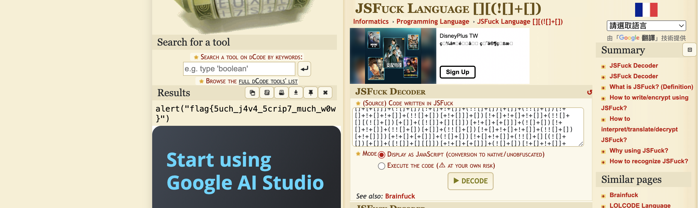
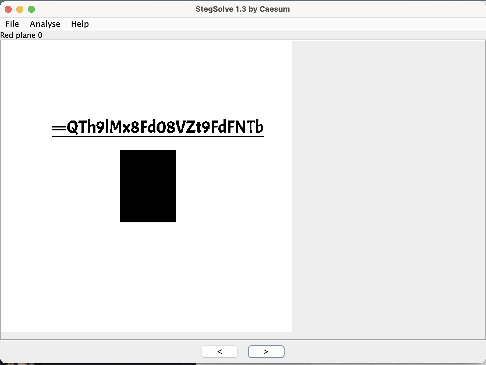

# Miscellaneous(Medium)

## What_could_this_be

* Website: https://ctflearn.com/challenge/268

* Solution: ```jsfuck```

    * ```jsfuck``` is esoteric and obfuscated programming style of JavaScript, where code is written using only six characters: ```[ ] ( ) + !.```

    * There is a online decoder to decode the ```jsfuck``` code

        

* Flag: ```flag{5uch_j4v4_5crip7_much_w0w}```

## Ambush_Mission

* Website: https://ctflearn.com/challenge/274

* Solution:  ```stegsolve```

    * We could use ```stegsolve``` to analyze the image 

        

    * Then, we could decode it!

* Code: ```python Ambush_Mission/Ambush_Mission.py```

* Flag: ```m3Et_me_4t_12_aM```

## Help_Bit

* Website: https://ctflearn.com/challenge/454

* Solution:  **xor**

    * We could first observe the binary representations of ```BUGM``` and ```CTFL```, we could find that the characters in ```BUGM...``` xor ```CTFL...``` is **1**. For example, ```ord(B) ^ ord(C) = 1```

    * We could then use the observation to extract the flag(but we need to add ```a``` since there are some a are missing)

* Code: ```python Help_Bity/Help_Bity.py```

* Flag: ```CTFLearn{b1nary_1s_awes0me}```

## 

* Website: 

* Solution:  

* Code: ``````

* Flag: ``````