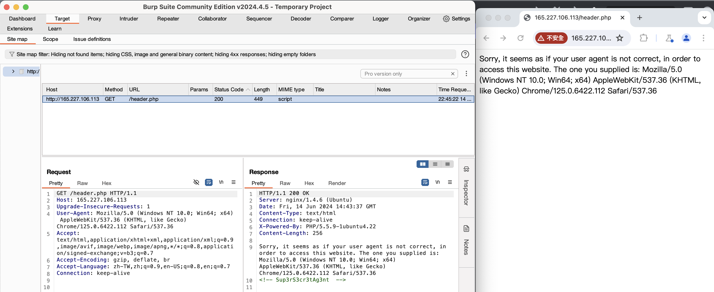
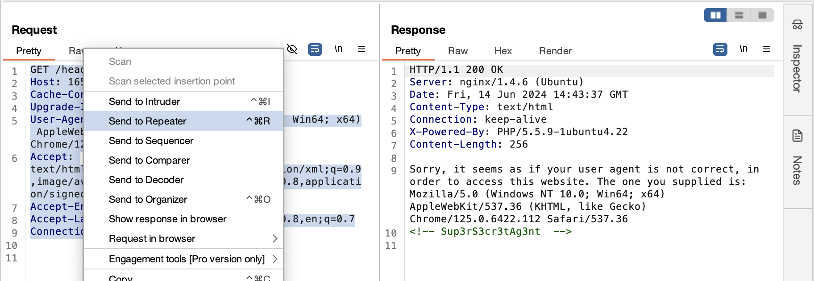
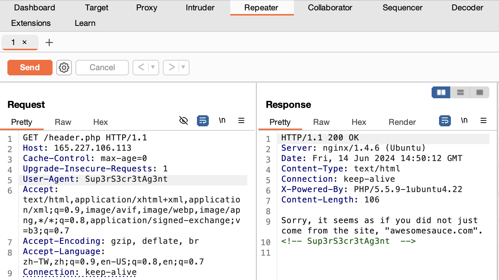
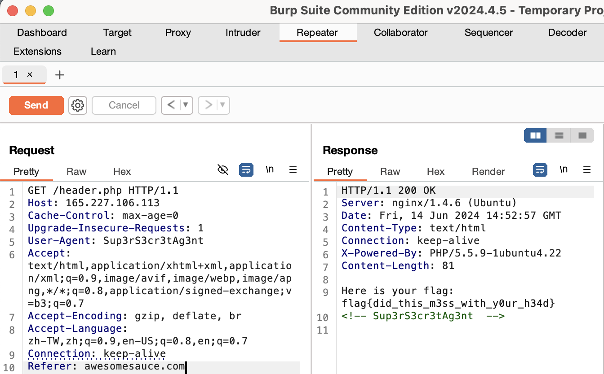

# CTFLEARN

## Basic Injection

* Website: https://ctflearn.com/challenge/88

* Solution: **SQL Injection**

    * The *Input* in website https://web.ctflearn.com/web4/ will turn to be 
        ```
        SELECT * FROM webfour.webfour where name = '$input'
        ```
    * We could type the following words to get the all dataset, to make the ' would have the correspondence
        ```
        test' or '1' = '1 
        ```
* Flag: ```CTFlearn{th4t_is_why_you_n33d_to_sanitiz3_inputs}```

## Forensics_101 

* Website: https://ctflearn.com/challenge/96

* Solution: **```strings``` Instruction**

    * ```strings <File_name>``` instruction: Would print **printable strings**

* Code: ```bash Forensics_101/Forensics_101.sh```

* Flag: ```flag{wow!_data_is_cool}```
    
## Character_Encoding

* Website: https://ctflearn.com/challenge/115

* Solution: **Heximal Encoding**

    * Convert the heximal number to the string!

* Code: ```python Character_Encoding/Character_Encoding.py```

    * ```bytearray.fromhex(<hex string>)``` could turn hex number to string. e.g. ```bytearray.fromhex('41') = b'A'```

* Flag: ```ABCTF{45C11_15_U53FUL}```

## Taking_LS

* Website: https://ctflearn.com/challenge/103

* Solution: **Check ```.<file_name>``` File**

    * Use ```ls -a``` to check whether there are some ```.<file_name>``` in it!

* Code: ```bash Taking_LS/Taking_LS.sh```

    * ```cat```: print the text in the file

* Flag: ```ABCTF{T3Rm1n4l_is_C00l}```

## Base_2_2_the6

* Website: https://ctflearn.com/challenge/192

* Solution: **Base64 Encoder/Decoder**

    * Base64: Turn ```8-bit```|```8-bit```|```8-bit``` to ```6-bit```|```6-bit```|```6-bit```|```6-bit```, and each 6-bit has a character

* Code: ```python Base_2_2_the6/Base_2_2_the6.py```

* Flag: ```CTF{FlaggyWaggyRaggy}```

## Morse_Code

* Website: https://ctflearn.com/challenge/309

* Solution **Morse Code**

    * Use Morse Code to get the flag information 

* Code: ```python Morse_Code/Morse_Code.py```

* Flag: ```FLAGSAMUELMORSEISCOOLBYTHEWAYILIKECHEES```

## Where_Can_My_Robot_Go

* Website: https://ctflearn.com/challenge/107

* Solution: ```robots.txt```

    * One text file placing under ```root```

    * Purpose: Tell the **Web Crawlers/Web Browser** which page could be crawled or not

    * Structure:
        
        * ```User-agent```: The rule would be applied to which web crawlers, often is ```*```
        
        * ```Disallow```: Disallow the path that web crawlers crawl

        * Example1: When we don't want ```/private``` to be accessed
            ```
            User-agent: *
            Disallow: /private/
            ```
        * Example2: When we allow all pages to be accessed
            ```
            User-agent: *
            Disallow: 
            ```
    
    * ```curl <website>```: Visit the content in ```<website>``` 

* Code: ```bash Where_Can_My_Robot_Go/Where_Can_My_Robot_Go.sh```

* Flag: ```CTFlearn{r0b0ts_4r3_th3_futur3}```

## Reverse_Polarity

* Website: https://ctflearn.com/challenge/230

* Solution: **Binary to ASCII**

    * Get the **Hexadecimal** of the number

    * Convert the hexadecimal number to the **byte expression**, using ```bytearray.fromhex(<hex>)```

* Code: ```python Reverse_Polarity/Reverse_Polarity.py```

* Flag: ```CTF{Bit_Flippin}```

## Wikipedia

* Website: https://ctflearn.com/challenge/168

* Solution: **Edit History(Diff)**

    * Search for ```128.125.52.138``` in English Wikipedia => Check ```Diff``` => See the flag

* Flag: ```cNi76bV2IVERlh97hP```

## WOW_So_Meta

* Website: https://ctflearn.com/challenge/348

* Solution: **```strings``` Instruction**

    * ```strings <file>```: To check information of the file

    * ```grep <strings>```: Grep something in the output text of the terminal

* Code: ```bash WOW_So_Meta/WOW_So_Meta.sh```

* Flag: ```flag{EEe_x_I_FFf}```

## POST_Practice

* Website: https://ctflearn.com/challenge/114

* Solution: **Find Username, Password in ```curl```**

    * See the username, password in the output of ```curl <website>```

    * Use ```requests.post(<website>, <data>)``` to get the response, where ```<data>``` equals to ```{username:..., password:...}```

* Code: ```python POST_Practice/POST_Practice.py```

* Flag: ```flag{p0st_d4t4_4ll_d4y}```

## Binwalk

* Website: https://ctflearn.com/challenge/108

* Solution: **Binwalk**

    * A tool for analyzing **binary files**
    
    * Commonly used: Penetration testing, analyze the contents within binary files, including data embedded in firmware, image files, compressed files, and more.

* Code: ```CTFLEARN/Binwalk/Binwalk.sh```

* Flag: ```ABCTF{b1nw4lk_is_us3ful}```

## Hextroadinary

* Website: https://ctflearn.com/challenge/158

* Solution: **xor**

    * Xor the two numbers

* Code: ```python Hextroadinary/Hextroadinary.py```

* Flag: ```0xc0ded```

## Vigenere_Cipher

* Website: https://ctflearn.com/challenge/305

* Solution: **Vigenere Cipher**

    * Use the key(in this case, *blorpy*) to decode the ciphertext($C_i - K_i = P_i \mod 26$)

        * $C_i$: Alphabet of ciphertext in position $i$

        * $K_i$: Alphabet of Key in position $i$

        * $P_i$: Alphabet of plantext in position $i$

* Code: ```python Vigenere_Cipher/Vigenere_Cipher.py```

* Flag: ```flag{CiphersAreAwesome}```

## Dont_Bump_Your_Head

* Website: https://ctflearn.com/challenge/109

* Solution: ```Burp Suite```

    * ```Burp Suite```: Tool for testing the security of web applications, including

        * **Scanner**: Scan whether there are some vulnerability

        * **Intruder**: Execute the automatical attack to the web

        * **Repeater**(mainly used in the problem): Modify requests to the server, resend them, and observe the results.

        * ...
    
    * Steps:

        1.  In ```Target``` page, click ```open browser``` and surf for the website

            

        2. Highlight the text in ```Request``` and click ```Send to Repeater```. Also, copy the hint text(```Sup3rS3cr3tAg3nt```)

            

        3. Go to ```Repeater``` page. In ```Request``` block, change ```user-agent``` to be the hint text(```Sup3rS3cr3tAg3nt```) and then click ```send```

            
        
        4. Since the ```Response``` block tells us that we must come from the site ```awesomesauce.com```, we would then add ```Referer: awesomesauce.com``` in the new line in ```Request``` block, and then click ```send```

            

        5. We could see the flag info!

* Flag: ```flag{did_this_m3ss_with_y0ur_h34d}```