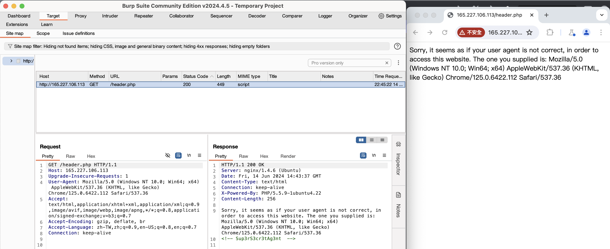
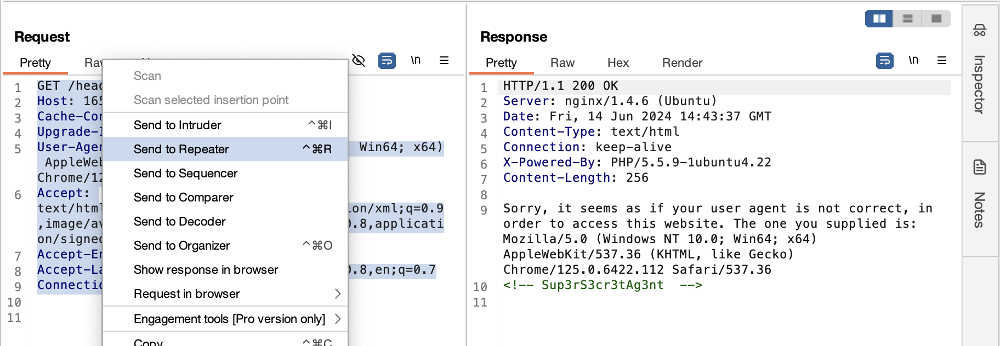
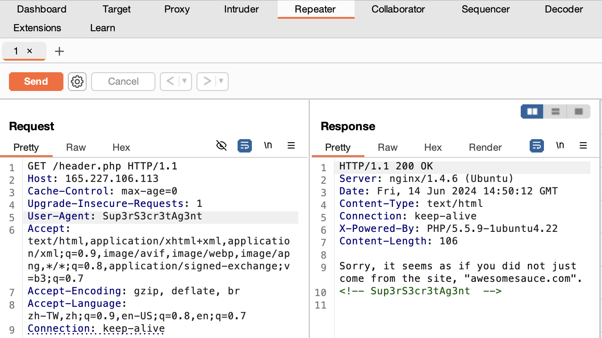
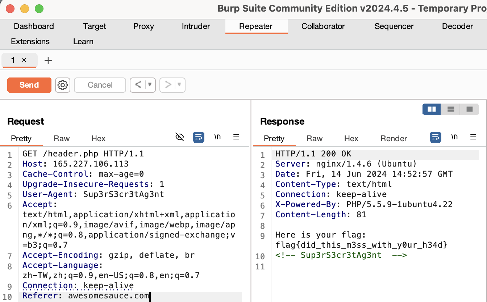

# Web(Medium)

## POST_Practice

* Website: https://ctflearn.com/challenge/114

* Solution: **Find Username, Password in ```curl```**

    * See the username, password in the output of ```curl <website>```

    * Use ```requests.post(<website>, <data>)``` to get the response, where ```<data>``` equals to ```{username:..., password:...}```

* Code: ```python POST_Practice/POST_Practice.py```

* Flag: ```flag{p0st_d4t4_4ll_d4y}```

## Dont_Bump_Your_Head

* Website: https://ctflearn.com/challenge/109

* Solution: ```Burp Suite```

    * ```Burp Suite```: Tool for testing the security of web applications, including

        * **Scanner**: Scan whether there are some vulnerability

        * **Intruder**: Execute the automatical attack to the web

        * **Repeater**(mainly used in the problem): Modify requests to the server, resend them, and observe the results.

        * ...
    
    * Steps:

        1.  In ```Target``` page, click ```open browser``` and surf for the website

            

        2. Highlight the text in ```Request``` and click ```Send to Repeater```. Also, copy the hint text(```Sup3rS3cr3tAg3nt```)

            

        3. Go to ```Repeater``` page. In ```Request``` block, change ```user-agent``` to be the hint text(```Sup3rS3cr3tAg3nt```) and then click ```send```

            
        
        4. Since the ```Response``` block tells us that we must come from the site ```awesomesauce.com```, we would then add ```Referer: awesomesauce.com``` in the new line in ```Request``` block, and then click ```send```

            

        5. We could see the flag info!

* Flag: ```flag{did_this_m3ss_with_y0ur_h34d}```